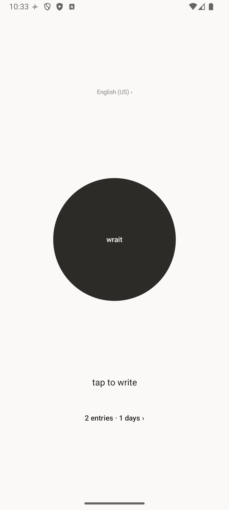
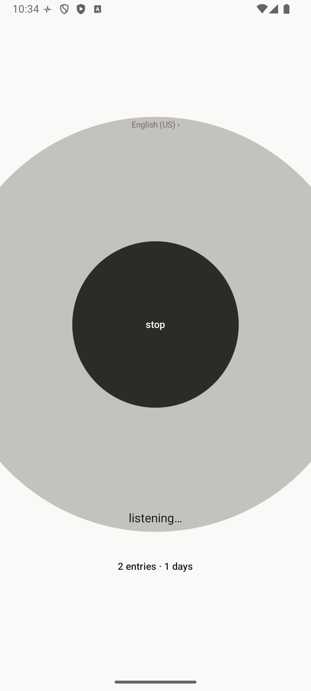
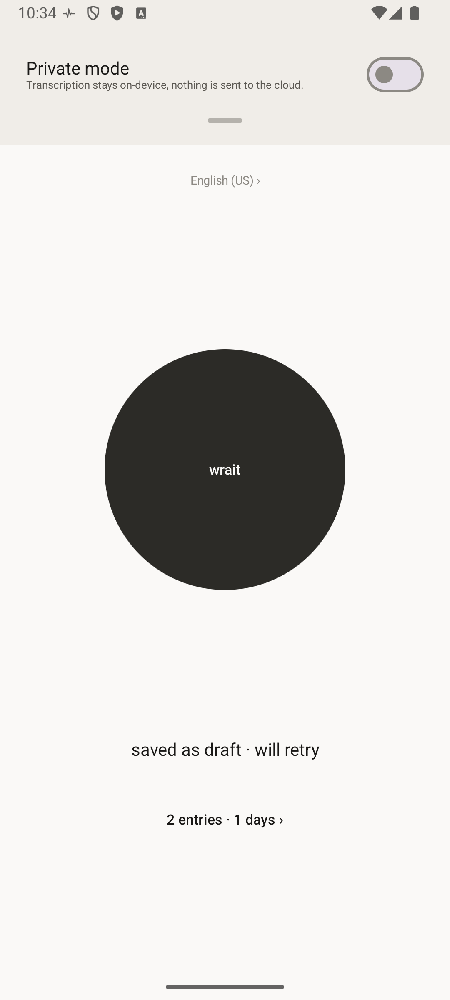

# wrait

*One button. Your voice. Your words. Stays on your phone.*

A minimal Android voice diary. Open it, tap the button, talk, tap again. Your entry is saved, cleaned up, and kept encrypted on your device. Nothing is stored in the cloud. There is no account.

---

## What it does

wrait records your voice, transcribes it, sends the transcript to an AI for cleanup (removing filler words and fixing punctuation), then saves the result encrypted on your phone. The audio is discarded the moment transcription is done.

The core loop takes about thirty seconds.

---

<p align="center">
  
  
  
</p>

---

<p align="center">
  <a href="https://github.com/santik/wrait/releases/latest">
    
  </a>
</p>

---

## Privacy model

### What stays on your device

- All diary entries — both the raw transcript and the cleaned text
- The encryption key (protected by Android Keystore hardware)
- Your language preference

### What leaves your device

This depends on your selected **privacy mode** (see below). In the default **Best** mode:

1. **Voice audio** is sent to [Deepgram](https://deepgram.com) (Nova-3) for transcription. This is a stateless API call — the audio is discarded immediately after transcription and never written to disk on the device.

2. **The raw transcript text** (not the cleaned entry) is sent to OpenAI's GPT API for cleanup. Same stateless model — no session, no history.

The cleaned entry text never leaves your device.

In **Private** mode, nothing leaves your device at all — transcription runs on-device via Android SpeechRecognizer.

### Privacy mode

wrait has two modes, switchable at runtime from the settings panel (swipe down from the top of the main screen):

| Mode | Transcription | Cleanup | Network required |
|------|--------------|---------|-----------------|
| **Best** | Deepgram Nova-3 (cloud) | OpenAI gpt-4o-mini (cloud) | Yes |
| **Private** | Android SpeechRecognizer (on-device) | None | No |

The selected mode takes effect on the next recording. No restart needed.

### What is never sent anywhere

- Cleaned diary entry text
- Device identifiers
- Location
- Any account information (there is no account)

### Local storage security

Entries are stored in a SQLite database encrypted with [SQLCipher](https://www.zetetic.net/sqlcipher/). The SQLCipher password is generated randomly, encrypted with [Tink](https://developers.google.com/tink) AEAD, and stored in shared preferences — the Tink keyset itself is protected by Android Keystore and never leaves the device. If you factory reset your phone, your entries are unrecoverable — this is intentional. Google's automatic cloud backup is explicitly disabled (`android:allowBackup="false"`).

Screenshots and the recent apps thumbnail are blocked via `FLAG_SECURE`.

---

## Building from source

### Requirements

- Android Studio Hedgehog or later
- JDK 17
- Android SDK 34
- A physical Android device (API 26+) or emulator

### Setup

1. Clone the repository:
   ```bash
   git clone https://github.com/your-username/wrait.git
   cd wrait
   ```

2. Create `local.properties` in the project root (this file is never committed):
   ```properties
   sdk.dir=/path/to/your/Android/sdk
   OPENAI_API_KEY=sk-...
   DEEPGRAM_API_KEY=...
   PRIVACY_MODE=MODE_BEST
   ```
   Set `PRIVACY_MODE=MODE_PRIVATE` to default to on-device-only mode. Omit `DEEPGRAM_API_KEY` if building in `MODE_PRIVATE` only.

3. Open in Android Studio and sync Gradle.

4. Run on a device or emulator:
   ```bash
   ./gradlew installDebug
   ```

### Running the tests

Instrumented tests run on a connected device or emulator:

```bash
./gradlew connectedAndroidTest
```

These are functional integration tests — they run against a real in-memory database and real ViewModels. There are no unit tests.

---

## Architecture

Single-module Android app written in Kotlin with Jetpack Compose.

```
com.wrait.app/
├── ui/           Compose screens and components
├── viewmodel/    ViewModels, UI state sealed classes
├── repository/   EntryRepository, PreferencesRepository
├── data/
│   ├── db/       Room entities, DAOs, encrypted database
│   ├── api/      OpenAI API service (cleanup + transcription)
│   └── prefs/    DataStore and EncryptedSharedPreferences
├── audio/        SpeechRecognizerManager
├── di/           Hilt modules
└── util/         DesignTokens, RecognitionConfig, extensions
```

### Transcription backends

Privacy mode is a runtime user setting (swipe down → settings panel) backed by DataStore. The default is set at build time via `PRIVACY_MODE` in `local.properties`:

- **`MODE_BEST`** — Deepgram Nova-3 STT (network) + OpenAI gpt-4o-mini cleanup (network). Draft-first pipeline: entry is written to DB before any API call.
- **`MODE_PRIVATE`** — Android `SpeechRecognizer` (on-device). No cleanup, no network calls. Entry saved immediately as final.

`ModeAwareTranscriptionService` reads the current DataStore value at call time, so switching modes takes effect on the next recording without restarting the app.

**Key decisions:**

- `StateFlow` throughout — no LiveData
- Draft-first pipeline: entry is written to the database before any API call. If the network drops mid-cleanup, your words are already safe.
- No Accompanist — microphone permission uses stable `ActivityResultContracts`
- Sealed result classes for all fallible operations — no exception propagation through the pipeline
- SQLCipher key protected via Tink AEAD + Android Keystore. If Keystore material becomes invalid, encrypted state is cleared and the DB setup is recreated.

---

## Known v1 limitations

- **No edit.** Entry text is read-only after saving. Revisit based on beta feedback.
- **No export.** Planned for v2 (plain text markdown files, one per entry).
- **No backup.** Factory reset means data loss. This is documented in the beta guide.
- **No biometric or PIN lock.** App-level lock planned for v2 as an opt-in setting.
- **No search.** Planned for a later version once there are enough entries to make it useful.
- **2-minute recording cap.** By design — longer recordings degrade cleanup quality and push the app toward voice memo territory.
- **Android only.** No iOS plans in the near term.
- **API key in binary.** In the closed beta build, the OpenAI and Deepgram keys are compiled into the APK via `BuildConfig`. This is acceptable for a private friends-and-family beta with hard spend caps set on both accounts.

---

## License

MIT. See [LICENSE](LICENSE).

---

*wrait — speak your mind. keep it private.*
