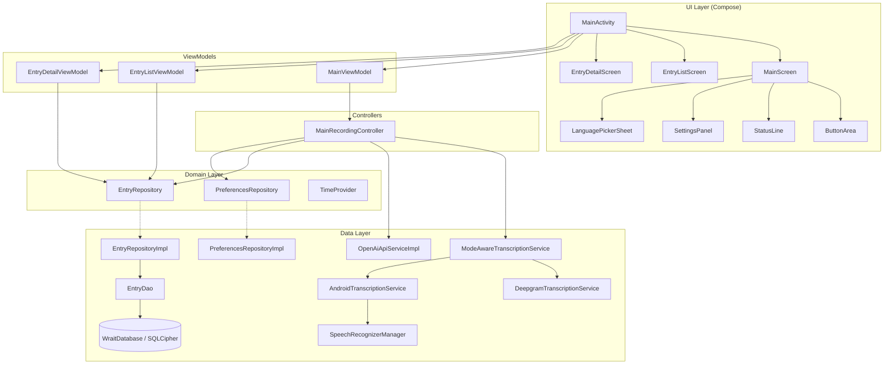
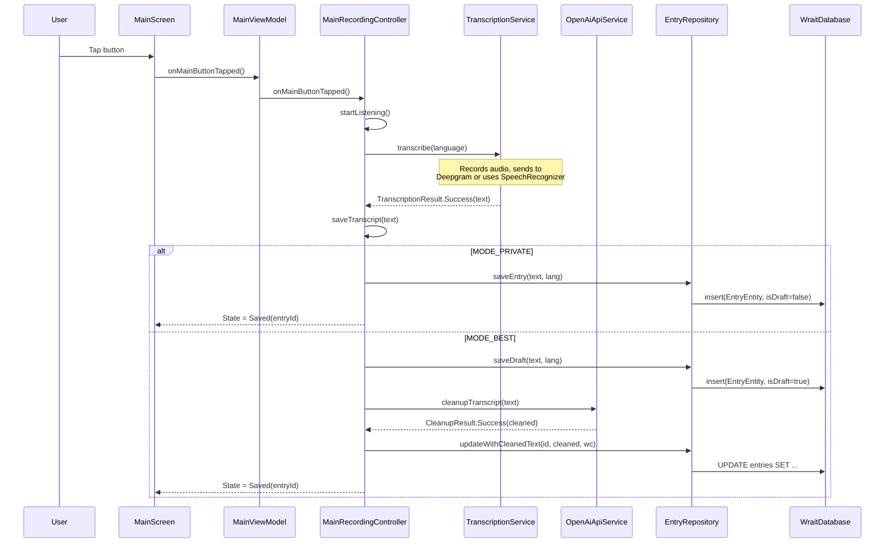
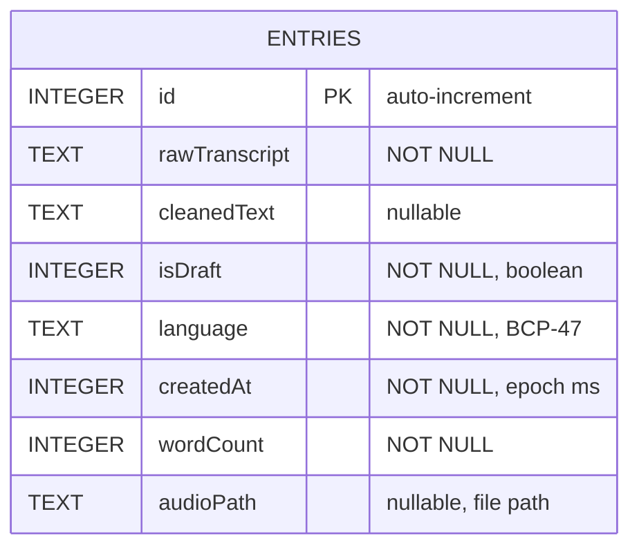
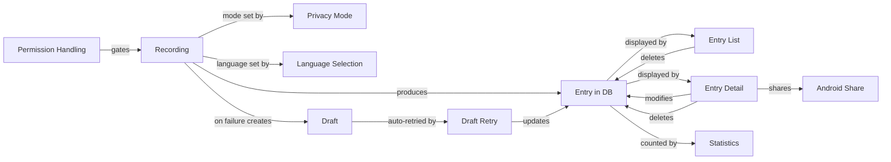
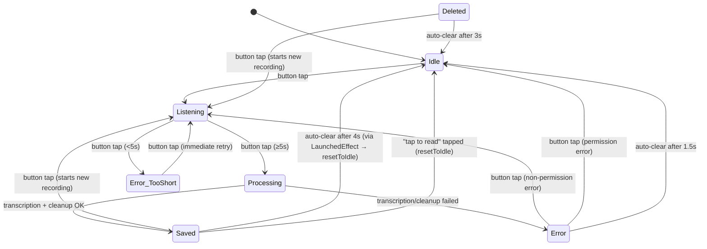

# wrait — Codebase Knowledge Document

> **Generated**: April 14, 2026
> **Repository**: `wrait` (single-module Android app)
> **Language**: Kotlin · **UI**: Jetpack Compose · **Architecture**: MVVM + Repository

---

## Table of Contents

1. [High-Level Overview](#1-high-level-overview)
2. [System Architecture](#2-system-architecture)
3. [Directory & File Map](#3-directory--file-map)
4. [Data Model & Database](#4-data-model--database)
5. [Dependency Injection Graph](#5-dependency-injection-graph)
6. [Feature-by-Feature Analysis](#6-feature-by-feature-analysis)
7. [Recording State Machine](#7-recording-state-machine)
8. [Transcription Pipeline](#8-transcription-pipeline)
9. [Security & Privacy Model](#9-security--privacy-model)
10. [UI Component Reference](#10-ui-component-reference)
11. [Navigation](#11-navigation)
12. [Testing Architecture](#12-testing-architecture)
13. [Build & Configuration](#13-build--configuration)
14. [Gotchas & Non-Obvious Design Decisions](#14-gotchas--non-obvious-design-decisions)
15. [Glossary](#15-glossary)
16. [Class & Function Reference](#16-class--function-reference)

---

## 1. High-Level Overview

### What It Is

**wrait** is a minimal Android voice diary app. The user opens it, taps a single button, speaks, taps again, and the recording is transcribed, cleaned up by AI, and saved encrypted on-device. There are no accounts, no cloud storage of diary content, and no login.

**Tagline**: *One button. Your voice. Your words. Stays on your phone.*

### Core Value Proposition

| Value        | How                                                                          |
|-------------|-----------------------------------------------------------------------------|
| Simplicity  | Single-button UI; core loop takes ~30 seconds                                |
| Privacy     | All entries encrypted on-device with SQLCipher + Tink AEAD + Android Keystore |
| Flexibility | Two runtime-switchable privacy modes (cloud vs on-device transcription)       |
| Security    | Screenshots blocked (`FLAG_SECURE`), backup disabled, no accounts            |

### Target Users

Friends-and-family closed beta. Privacy-conscious users who want fast, voice-first journaling without cloud accounts.

### Feature Overview & Business Purpose

| #  | Feature                    | Business Purpose                                                       | Key Interaction                              |
|----|----------------------------|------------------------------------------------------------------------|----------------------------------------------|
| F1 | Voice Recording & STT      | Core value — one-tap capture of spoken journal entries                  | Produces entries consumed by F2, F8, F9       |
| F2 | Entry Viewing (List+Detail)| Let users review and re-read past entries                              | Reads entries from F1; gateway to F3–F5       |
| F3 | Entry Editing              | Allow correction of AI cleanup mistakes or user second thoughts         | Modifies entries created by F1                |
| F4 | Entry Deletion             | Privacy control — permanently remove entries                            | Removes entries; updates F9 stats             |
| F5 | Entry Sharing              | Export entry text to other apps (email, messaging)                      | Reads entry from F2 detail screen             |
| F6 | Language Selection         | Support multilingual users for transcription                            | Configures F1 recording language              |
| F7 | Privacy Mode Toggle        | User-controlled tradeoff between quality (cloud) and privacy (on-device)| Switches F1 transcription backend at runtime  |
| F8 | Draft Retry (Automatic)    | Never lose user's words — retry failed network ops on next launch       | Finalizes drafts from F1 failures             |
| F9 | Statistics                 | Motivate continued journaling with entry count and streak-like metrics  | Aggregates entries from F1; displayed on main |
| F10| Permission Handling        | Ensure mic access; guide user through Android permission flows          | Gate-keeps F1 recording                       |

### How Features Relate (High Level)

Recording (F1) is the central feature — everything else depends on it. F1 produces entries that flow into viewing (F2), editing (F3), deletion (F4), sharing (F5), and statistics (F9). Language (F6) and privacy mode (F7) configure F1's behavior. Draft retry (F8) is a resilience mechanism for F1 failures. Permission handling (F10) gates F1 entirely. See §6 for a detailed Mermaid diagram.

### Tech Stack Summary

| Layer             | Technology                                                     |
|-------------------|---------------------------------------------------------------|
| Language          | Kotlin 2.3.x                                                  |
| UI                | Jetpack Compose (Material 3, BOM `2026.03.01`)               |
| DI                | Hilt 2.59.2                                                    |
| Database          | Room 2.8.4 + SQLCipher 4.14.1                                |
| Encryption        | Google Tink 1.21.0 AEAD + Android Keystore                    |
| Networking        | Ktor 3.4.2 (Android engine)                                   |
| Preferences       | Jetpack DataStore Preferences 1.2.1                           |
| Navigation        | Navigation Compose 2.9.7                                       |
| Async             | Kotlin Coroutines 1.10.2, `StateFlow` throughout (no LiveData)|
| Speech (on-device)| Android `SpeechRecognizer`                                     |
| Speech (cloud)    | Deepgram Nova-3 REST API                                       |
| AI Cleanup        | OpenAI gpt-4o-mini (`/v1/chat/completions`)                   |
| Min SDK           | 26 · Target/Compile SDK: 36                                    |
| Build             | Gradle 9.1.0 (Kotlin DSL), KSP                                |

---

## 2. System Architecture

### Architecture Pattern

**MVVM + Repository** with clean-architecture-style layering:

- **UI Layer** → Composables + ViewModels (`StateFlow`-driven, unidirectional data flow)
- **Domain Layer** → Interfaces (`EntryRepository`, `PreferencesRepository`), models (`Entry`, `PrivacyMode`), utility abstractions (`TimeProvider`)
- **Data Layer** → Room DAO, repository implementations, API services, transcription backends

### High-Level Architecture Diagram



### Data Flow: Recording to Saved Entry



### Cross-Cutting Concerns

#### Logging

- **Framework**: Standard `android.util.Log` with per-class `TAG` constants.
- **Level usage**: `Log.d` for normal flow (recording start/stop, transcription received, draft saved), `Log.w` for recoverable issues (API errors, file deletion failures), `Log.e` for unexpected failures (recorder start failure, preference persistence failure).
- **No structured logging framework** — no Timber, no crash reporting SDK.
- **Sensitive data**: API keys are never logged. Transcript content is not logged (only lengths and word counts). Audio file paths are logged at debug level.
- **Log locations**: `MainRecordingController` (pipeline events), `DeepgramTranscriptionService` (upload/response), `SpeechRecognizerManager` (restart events), `OpenAiApiServiceImpl` (API outcomes), `EntryRepositoryImpl` (mapping errors), `MainViewModel` (language save, draft retry).

#### Caching

- **No explicit caching layer**. The app is simple enough that Room's `Flow`-based reactive queries serve as the live data source.
- **Temporary files**: Audio recordings go to `context.cacheDir` during recording. On success the temp file is deleted. On upload failure the temp file is moved to `context.filesDir/audio_drafts/` as a persistent draft.
- **StateFlow caching**: `SharingStarted.Eagerly` and `SharingStarted.WhileSubscribed(5_000)` provide compose-level caching of database queries. No TTL, no invalidation — Room handles reactivity.

#### Authentication & Authorization

- **No user authentication** — the app has no accounts, no login, no server-side identity.
- **API authentication**: Bearer token (OpenAI) and Token auth (Deepgram), both compiled into `BuildConfig` from `local.properties`. No token refresh, no OAuth flows.
- **Device-level security**: Database encryption keys are bound to the Android Keystore hardware. If the Keystore is invalidated (factory reset, lock screen removed), all data is lost — there is no recovery mechanism by design.

#### Error Handling Strategy

- **Sealed result classes everywhere**: `TranscriptionResult`, `CleanupResult`, `RecognitionResult` — no exceptions propagated through the pipeline.
- **Draft-first safety net**: In MODE_BEST, data is always written to the database before any network call. Network failures cannot lose user data.
- **Silent error swallowing**: Some errors are intentionally silent — `deleteEntries` failure in `EntryListViewModel` keeps the entry visible (fail-safe), `setHasEverRecorded` failure is caught and logged but doesn't block the pipeline.
- **Retry strategy**: Network errors use up to 3 retries with exponential backoff (1s, 2s, 4s) for uploads. Draft retry on app startup is once-per-launch, not periodic.

#### Threading

- **All database operations** run on `@IoDispatcher` (`Dispatchers.IO`), injected via Hilt.
- **Recording** (`MediaRecorder`) runs on `Dispatchers.IO` within the transcription service.
- **SpeechRecognizer** callbacks dispatch to `Dispatchers.Main` (required by Android API).
- **UI state** flows via `StateFlow` — no thread-safety issues; single-writer pattern.
- **ViewModel scopes**: All coroutines launch in `viewModelScope`; `MainRecordingController` receives the same scope.

---

## 3. Directory & File Map

```
app/src/main/java/com/wrait/app/
├── WraitApp.kt                         # Application class (@HiltAndroidApp)
├── MainActivity.kt                     # Single Activity, Compose NavHost, permission handling
├── MainViewModel.kt                    # Main screen ViewModel, stats, recording orchestration
├── MainRecordingController.kt          # Recording state machine & pipeline
├── LanguageUtils.kt                    # isLanguageMismatch() utility
├── RecordingState.kt                   # (Defined in MainRecordingController.kt) Sealed class
├── data/
│   ├── EntryEntity.kt                  # Room @Entity — entries table
│   ├── EntryDao.kt                     # Room @Dao — all SQL queries
│   ├── WraitDatabase.kt                # Room database (version 2, SQLCipher)
│   ├── api/
│   │   ├── OpenAiApiService.kt         # Interface + CleanupResult sealed class
│   │   ├── OpenAiApiServiceImpl.kt     # Ktor-based GPT-4o-mini client
│   │   └── OpenAiModels.kt            # @Serializable request/response DTOs
│   ├── mapper/
│   │   └── EntryMapper.kt             # EntryEntity ↔ Entry mapping extensions
│   ├── repository/
│   │   ├── EntryRepositoryImpl.kt      # Full CRUD impl with draft lifecycle
│   │   └── PreferencesRepositoryImpl.kt # DataStore-backed preferences
│   ├── speech/
│   │   ├── TranscriptionService.kt     # Interface + TranscriptionResult + enums
│   │   ├── ModeAwareTranscriptionService.kt  # Routes to Deepgram or Android
│   │   ├── DeepgramTranscriptionService.kt   # MediaRecorder → Deepgram REST
│   │   ├── WhisperTranscriptionService.kt    # MediaRecorder → OpenAI Whisper (alt)
│   │   ├── AndroidTranscriptionService.kt    # Wraps SpeechRecognizerManager
│   │   ├── SpeechRecognizerManager.kt        # Android SpeechRecognizer callbackFlow
│   │   └── RecognitionConfig.kt              # Timing constants
│   └── util/
│       └── SystemTimeProvider.kt       # Production TimeProvider impl
├── di/
│   ├── ApiModule.kt                    # Binds OpenAiApiService
│   ├── DatabaseModule.kt              # Provides WraitDatabase, EntryDao, DB password
│   ├── DataStoreModule.kt             # Provides DataStore, binds PreferencesRepository
│   ├── DispatchersModule.kt           # @IoDispatcher qualifier
│   ├── RepositoryModule.kt            # Binds EntryRepository, TimeProvider
│   └── TranscriptionModule.kt        # Binds TranscriptionService → ModeAware
├── domain/
│   ├── model/
│   │   ├── Entry.kt                    # Domain model
│   │   ├── EntryStats.kt              # entryCount + activeDays
│   │   ├── PrivacyMode.kt             # MODE_BEST | MODE_PRIVATE enum
│   │   └── SupportedLanguages.kt      # Set of BCP-47 codes
│   ├── repository/
│   │   ├── EntryRepository.kt          # Interface
│   │   └── PreferencesRepository.kt    # Interface
│   └── util/
│       └── TimeProvider.kt             # Interface for testability
└── ui/
    ├── main/
    │   ├── MainScreen.kt               # Primary recording UI
    │   ├── ButtonArea.kt               # Action button + pulse ring + shake
    │   ├── PulseRing.kt                # Infinite pulse animation
    │   └── LanguagePickerSheet.kt      # ModalBottomSheet language list
    ├── entries/
    │   ├── EntryListScreen.kt          # Reverse-chronological entry list
    │   ├── EntryListViewModel.kt       # List VM
    │   ├── EntryDetailScreen.kt        # Full entry view/edit/share/delete
    │   └── EntryDetailViewModel.kt     # Detail VM with debounced edits
    ├── settings/
    │   └── SettingsPanel.kt            # Privacy mode toggle overlay
    └── theme/
        ├── Color.kt                    # Light/dark palette
        ├── Theme.kt                    # WrAItTheme composable
        ├── Type.kt                     # Typography scale
        └── DesignTokens.kt            # Animation durations, spacing, button sizing
```

### Test Files

```
app/src/androidTest/java/com/wrait/app/
├── MainRecordingControllerTest.kt      # Recording state machine tests
├── MainViewModelTest.kt                # ViewModel integration tests
├── PrimaryRecordingFlowTest.kt         # End-to-end recording flow
├── FullJourneyTest.kt                  # Full user journey test
├── data/
│   ├── DatabaseMigrationTest.kt        # Room migration v1→v2
│   ├── EntryDaoTest.kt                 # DAO query tests
│   ├── EntryRepositoryTest.kt          # Repository logic tests
│   ├── EntryRepositoryExtensionsTest.kt
│   └── PreferencesRepositoryTest.kt
├── test/
│   ├── HiltTestRunner.kt              # Custom test runner for Hilt
│   ├── fake/
│   │   ├── FakeTranscriptionService.kt
│   │   ├── FakeOpenAiApiService.kt
│   │   ├── FakePreferencesRepository.kt
│   │   └── FakeSpeechRecognizerManager.kt
│   └── util/
│       └── FakeTimeProvider.kt

app/src/test/java/com/wrait/app/
├── KeepScreenOnCommandTest.kt          # Pure JVM unit test
```

---

## 4. Data Model & Database

### Database: `WraitDatabase` (`app/src/main/java/com/wrait/app/data/WraitDatabase.kt`)

- **Engine**: Room + SQLCipher (encrypted SQLite)
- **Current version**: 2
- **Export schema**: Yes (`app/schemas/`)
- **Fallback**: `fallbackToDestructiveMigration(true)` — data is intentionally lost if migration fails

### Entity: `entries` table

| Column          | Type     | Nullable | Description                                   |
|----------------|---------|----------|-----------------------------------------------|
| `id`           | INTEGER  | NOT NULL | Auto-generated primary key                     |
| `rawTranscript`| TEXT     | NOT NULL | Original STT output                            |
| `cleanedText`  | TEXT     | YES      | AI-cleaned version (null if not cleaned)       |
| `isDraft`      | INTEGER  | NOT NULL | 1 = pending cleanup, 0 = finalized            |
| `language`     | TEXT     | NOT NULL | BCP-47 code (e.g. "en-US", "fr")              |
| `createdAt`    | INTEGER  | NOT NULL | Unix timestamp (milliseconds)                  |
| `wordCount`    | INTEGER  | NOT NULL | Word count of cleaned/raw text                 |
| `audioPath`    | TEXT     | YES      | File path for audio-only drafts (v2 column)    |

### ER Diagram



### Migration History

- **v1 → v2** (`WraitDatabase.MIGRATION_1_2`): Added `audioPath TEXT` column to `entries` table.

### Domain Model: `Entry` (`app/src/main/java/com/wrait/app/domain/model/Entry.kt`)

Mirrors `EntryEntity` exactly. Mapped via extension functions in `app/src/main/java/com/wrait/app/data/mapper/EntryMapper.kt`.

### Entry Lifecycle

```
               ┌──────────────┐
               │  Audio Draft  │  audioPath != null, rawTranscript = ""
               │  (isDraft=1)  │  Created when cloud transcription fails
               └──────┬───────┘
                      │ retry → transcribe audio
                      ▼
               ┌──────────────┐
               │  Text Draft   │  rawTranscript set, audioPath = null
               │  (isDraft=1)  │  Created on successful transcription (MODE_BEST)
               └──────┬───────┘
                      │ OpenAI cleanup succeeds
                      ▼
               ┌──────────────┐
               │  Final Entry  │  cleanedText set, isDraft=0
               │  (isDraft=0)  │  Ready for user to read
               └──────────────┘

MODE_PRIVATE: Audio → Final Entry (isDraft=0) directly, no draft stage.
```

### Stale Draft Cleanup

- `EntryRepositoryImpl.deleteStaleDrafts()` — deletes drafts older than 7 days.
- Called during `MainViewModel.initJob` at app startup.
- Also cleans up associated audio files on disk.

---

## 5. Dependency Injection Graph

All DI is configured via Hilt modules in `app/src/main/java/com/wrait/app/di/`.

### Module Map

| Module                  | Scope        | Provides / Binds                                              |
|------------------------|-------------|--------------------------------------------------------------|
| `DatabaseModule`       | Singleton   | `ByteArray` (DB password), `WraitDatabase`, `EntryDao`       |
| `DataStoreModule`      | Singleton   | `DataStore<Preferences>`                                      |
| `DataStoreBindsModule` | Singleton   | `PreferencesRepository` → `PreferencesRepositoryImpl`         |
| `RepositoryModule`     | Singleton   | `EntryRepository` → `EntryRepositoryImpl`, `TimeProvider` → `SystemTimeProvider` |
| `ApiModule`            | Singleton   | `OpenAiApiService` → `OpenAiApiServiceImpl`                   |
| `TranscriptionModule`  | Singleton   | `TranscriptionService` → `ModeAwareTranscriptionService`      |
| `DispatchersModule`    | (unscoped)  | `@IoDispatcher CoroutineDispatcher` → `Dispatchers.IO`        |

### Key Binding Chain

```
TranscriptionService
  └─ ModeAwareTranscriptionService (reads PrivacyMode at call time)
       ├─ DeepgramTranscriptionService   (MODE_BEST)
       └─ AndroidTranscriptionService    (MODE_PRIVATE, preferOffline=true)
            └─ SpeechRecognizerManager   (on-device recognizer when offline)

OpenAiApiService
  └─ OpenAiApiServiceImpl (Ktor HTTP client → OpenAI API)
```

### Note on `MainRecordingController`

`MainRecordingController` is **not** a Hilt-managed component. It is instantiated manually inside `MainViewModel`'s constructor, receiving its dependencies from the ViewModel's own injected fields. This avoids scoping issues with the controller's `CoroutineScope` (which must be `viewModelScope`).

---

## 6. Feature-by-Feature Analysis

### Feature 1: Voice Recording & Transcription

**Business Purpose**: Core value — capture voice journal entries with minimal friction.

**Technical Flow**:
1. **Entry point**: `MainScreen.ButtonArea.onTap` → `MainActivity.onMainButtonTapped` → `MainViewModel.onMainButtonTapped()` → `MainRecordingController.onMainButtonTapped()`
2. **State machine**: `RecordingState.Idle → Listening → Processing → Saved`
3. **Recording**:
   - **MODE_BEST**: `DeepgramTranscriptionService.record()` uses `MediaRecorder` → AAC/M4A → uploaded via Ktor to `api.deepgram.com/v1/listen?model=nova-3`
   - **MODE_PRIVATE**: `AndroidTranscriptionService` wraps `SpeechRecognizerManager.listen(preferOffline = true)` which creates a `callbackFlow` over Android's `SpeechRecognizer` using **on-device recognition** (no internet required). On API 31+ it uses `createOnDeviceSpeechRecognizer()`; on older APIs it sets `EXTRA_PREFER_OFFLINE`.
4. **Duration**: Min 5 seconds (`MIN_RECORDING_MS` in controller), max 2 minutes (`RecognitionConfig.HardCapMs`)
5. **Cleanup (MODE_BEST only)**: `OpenAiApiServiceImpl.cleanupTranscript()` sends raw text to GPT-4o-mini with a cleanup prompt
6. **Draft-first save**: In MODE_BEST, entry is saved as a draft *before* the cleanup API call

**Key Files**:
- `app/src/main/java/com/wrait/app/MainRecordingController.kt` — State machine + pipeline
- `app/src/main/java/com/wrait/app/data/speech/DeepgramTranscriptionService.kt` — Cloud STT
- `app/src/main/java/com/wrait/app/data/speech/AndroidTranscriptionService.kt` — On-device STT
- `app/src/main/java/com/wrait/app/data/speech/SpeechRecognizerManager.kt` — Android SpeechRecognizer wrapper
- `app/src/main/java/com/wrait/app/data/api/OpenAiApiServiceImpl.kt` — GPT cleanup

**Edge Cases**:
- Recording < 5s: `TooShort` error with shake animation
- `SpeechRecognizer` silence timeout: Auto-restarts up to 100 times (`RecognitionConfig.MaxRestartAttempts`) to maintain continuous recording
- Network failure during upload: Audio persisted as draft file in `filesDir/audio_drafts/`
- Cleanup failure: Entry remains as draft, retried on next app launch
- Transcript > 10,000 chars: Logged and truncated (belt-and-braces guard in `saveTranscript()`)
- Transcript > 3,000 chars: Truncated before sending to OpenAI cleanup (`OpenAiApiServiceImpl`)
- Blank transcript: Emits `TooShort` error, never saved to DB
- Deepgram returns empty channels / empty transcript: Mapped to `NothingCaught` failure
- Audio file > 10MB: Mapped to `ApiError` failure (Deepgram backend)
- Audio file < 1KB: Mapped to `TooShort` failure (Deepgram backend)
- `stopRecording()` in `ModeAwareTranscriptionService` stops BOTH backends (cheap no-op on idle one)
- `delayAndReset()` launches a separate `resetJob` coroutine that auto-clears Error/Saved states to Idle after 1.5s; `startListening()` cancels any pending `resetJob`

**Hidden Dependencies**:
- Recording requires `RECORD_AUDIO` permission (gated by F10)
- MODE_BEST requires network (gated by `INTERNET` permission in manifest)
- `hasEverRecorded` flag is set during the recording pipeline, affecting StatusLine display text
- `SpeechRecognizer.isRecognitionAvailable()` check — some devices/ROMs lack on-device speech support

---

### Feature 2: Entry Viewing (List + Detail)

**Business Purpose**: Let users review past journal entries.

**Technical Flow**:
1. **Navigation**: Swipe up on MainScreen → `entries` route → `EntryListScreen`
2. **Data**: `EntryListViewModel.uiState` observes `EntryRepository.getAllEntries()` (Room `Flow`)
3. **Sorting**: Entries sorted reverse-chronologically in the composable
4. **Detail**: Tap entry → `entry/{entryId}` route → `EntryDetailScreen` + `EntryDetailViewModel`
5. **Detail VM** loads entry via `entryRepository.getEntryById(id)` as `Flow<Result<Entry?>>`

**Key Files**:
- `app/src/main/java/com/wrait/app/ui/entries/EntryListScreen.kt`
- `app/src/main/java/com/wrait/app/ui/entries/EntryListViewModel.kt`
- `app/src/main/java/com/wrait/app/ui/entries/EntryDetailScreen.kt`
- `app/src/main/java/com/wrait/app/ui/entries/EntryDetailViewModel.kt`

**Edge Cases & Hidden Dependencies**:
- Sorting is done in the composable (`remember(uiState.entries)`) — not in the DAO query (which already orders by `createdAt DESC`)
- `getEntryById()` returns `Flow<Result<Entry?>>` — wraps mapping errors in `Result.failure()` so the UI can show an error state instead of crashing
- Detail screen shows different content for drafts vs finalized entries: drafts show raw transcript in `SelectionContainer` (read-only), finalized entries show `BasicTextField` (editable)
- Audio-only drafts (no transcript yet) show "Audio draft. Not transcribed yet."
- Swipe-to-dismiss on detail screen uses `NestedScrollConnection` — only triggers when scroll position is at top
- Entry list swipe-to-delete uses `AnchoredDraggableState` with 80dp reveal distance
- Empty list state shows "your entries will appear here" with swipe-down-to-back gesture via `pointerInput`

---

### Feature 3: Entry Editing

**Business Purpose**: Allow users to correct or modify saved entries.

**Technical Flow**:
1. `EntryDetailScreen` renders `BasicTextField` for non-draft entries
2. `EntryDetailViewModel.onTextChanged()` updates `_editedText: MutableStateFlow`
3. Debounced (500ms) `persistEdit()` calls `entryRepository.updateWithCleanedText(id, text, wordCount)`
4. On back navigation, `flushEdit()` immediately persists any pending edit

**Key File**: `app/src/main/java/com/wrait/app/ui/entries/EntryDetailViewModel.kt`

**Edge Cases & Hidden Dependencies**:
- Editing reuses `updateWithCleanedText()` — this clears `isDraft` flag and sets `audioPath = NULL`. Editing a draft would finalize it (but UI prevents this: drafts get read-only `SelectionContainer`)
- `_editedText` is initialized to `null` and only populated on the first collect of the entry flow. This prevents overwriting with stale data on recomposition
- Word count is recalculated on every persist with `split("\\s+".toRegex())`
- If `persistEdit()` fails (DB error), the error is logged but not surfaced to the user — the text remains in the `_editedText` flow and will be retried on next debounce/flush

---

### Feature 4: Entry Deletion

**Business Purpose**: Users can remove entries they no longer want.

**Two Paths**:
1. **From list**: Swipe-right reveals delete button → confirmation dialog → `EntryListViewModel.deleteEntry(id)`
2. **From detail**: Delete icon → confirmation dialog → `EntryDetailViewModel.confirmDelete()` → navigates back to list

**Cleanup**: `EntryRepositoryImpl.deleteEntries()` also deletes associated audio files from disk.

**Edge Cases & Hidden Dependencies**:
- Audio file deletion is best-effort — exceptions are caught and silently ignored
- Delete from list: if DB delete fails, the entry remains visible (fail-safe — `catch (_: Exception)` in `EntryListViewModel`)
- Delete from detail: navigates to `"entries"` route with `popUpTo("entries") { inclusive = true }` — this resets the list backstack
- `MainRecordingController.onEntriesDeleted(count)` emits `RecordingState.Deleted(count)` which shows "entry deleted" / "N entries deleted" for 3 seconds

---

### Feature 5: Entry Sharing

**Business Purpose**: Share diary entries to other apps (email, messaging, etc.).

**Technical Flow**: `EntryDetailScreen` share button → `Intent.ACTION_SEND` with `text/plain` → Android share sheet.

**Format**: `"$formattedDate\n\n$body"` (via `buildShareMessage()` in `EntryDetailScreen.kt`)

**Edge Cases & Hidden Dependencies**:
- Share is only available for non-draft entries (`shareableTextForShare()` returns `null` for drafts)
- Prefers `cleanedText` over `rawTranscript`; falls back to raw if cleaned is blank
- `Intent.resolveActivity()` check before launching — shows Toast if no app can handle the intent
- `ActivityNotFoundException` caught and shown as Toast

---

### Feature 6: Language Selection

**Business Purpose**: Support multilingual users for transcription.

**Technical Flow**:
1. Tap language label on MainScreen → `LanguagePickerSheet` (Material ModalBottomSheet)
2. 11 languages supported (defined in `LANGUAGES` list in `LanguagePickerSheet.kt` and `SUPPORTED_LANGUAGE_CODES` in `SupportedLanguages.kt`)
3. Selection saved via `PreferencesRepository.setLanguage()` → DataStore
4. Language is read from `StateFlow` at transcription time — no restart needed

**Supported Languages**: en-US, nl-NL, ru-RU, uk-UA, de-DE, es-ES, fr-FR, it-IT, pl-PL, pt-PT, tr-TR

**Language Detection**: In MODE_BEST, Deepgram returns `detected_language`. If it differs from the selected language (compared by base code via `isLanguageMismatch()`), the entry is tagged with the detected language. The user's preference is never changed.

---

### Feature 7: Privacy Mode Toggle

**Business Purpose**: Balance transcription quality vs. privacy.

**Two Modes**:
| Mode         | Transcription            | Cleanup             | Network |
|-------------|--------------------------|---------------------|---------|
| `MODE_BEST` | Deepgram Nova-3 (cloud)  | GPT-4o-mini (cloud) | Yes     |
| `MODE_PRIVATE`| Android SpeechRecognizer | None                 | No      |

**Technical Flow**:
1. Swipe down on MainScreen → `SettingsPanel` overlay
2. Toggle switch → `MainViewModel.onPrivacyModeToggle()` → `PreferencesRepository.savePrivacyMode()`
3. `ModeAwareTranscriptionService.backend()` reads `privacyMode.first()` at each `transcribe()` call
4. Default set at build time via `PRIVACY_MODE` in `local.properties`, seeded on first launch via `seedPrivacyModeOnce()`

---

### Feature 8: Draft Retry (Automatic)

**Business Purpose**: Never lose user's words — retry failed operations on next launch.

**Technical Flow** (in `MainViewModel.retryPendingDrafts()`):
1. Called during `initJob` (app startup), only in MODE_BEST
2. Loads all drafts via `entryRepository.getPendingDrafts()`
3. For each draft:
   - **Audio draft** (`audioPath != null`): Retries transcription → if successful, calls cleanup → finalizes or converts to text draft
   - **Text draft** (`rawTranscript` present): Retries OpenAI cleanup → updates entry
4. Audio files deleted after successful transcription

**Edge Cases & Hidden Dependencies**:
- Retry runs in `viewModelScope` within `initJob` — if the app is killed during retry, the draft survives in DB for next launch
- Language mismatch can occur during audio draft retry — the entry is silently re-tagged with the detected language
- Failed cleanup during retry converts audio-only draft to text draft (still valuable: raw transcript preserved, audio deleted)
- `currentCoroutineContext().ensureActive()` check inside the draft loop allows cancellation between drafts
- Stale draft cleanup (`deleteStaleDrafts()`) runs BEFORE retry — drafts older than 7 days are deleted, not retried

---

### Feature 9: Statistics

**Business Purpose**: Motivate continued journaling with simple stats.

**Display**: StatsLine on MainScreen shows `"X entries · Y days"`

**Computation**: `MainViewModel.computeStats()` maps entry timestamps to `LocalDate` (using system timezone) and counts unique dates.

**Edge Cases**: Stats include drafts in the count (all entries from `getAllEntries()` are counted). Stats line is non-tappable during active recording (Listening/Processing/Uploading states).

---

### Feature 10: Permission Handling

**Business Purpose**: Ensure microphone access is granted before recording; guide user through Android's permission model without losing context.

**Technical Flow** (in `MainActivity.kt`):
1. On button tap, check `RECORD_AUDIO` permission via `ContextCompat.checkSelfPermission()`
2. If granted: proceed to `viewModel.onMainButtonTapped()`
3. If not granted:
   - Check if permanently denied (`shouldShowRequestPermissionRationale()` returns false after previous denial)
   - If permanently denied: show blocked message + open app settings via `ACTION_APPLICATION_DETAILS_SETTINGS` intent
   - If not permanently denied: launch `requestPermissionLauncher` (ActivityResultContracts)
4. On permission result:
   - Granted: clear blocked state, proceed
   - Denied: check permanent denial, show settings link if needed
5. On `ON_RESUME` lifecycle event: re-check permission (user may have toggled it in settings)
6. If permission revoked while app running: `viewModel.onPermissionRevoked()` → `stopListening(forceIdle = true)`

**Key File**: `app/src/main/java/com/wrait/app/MainActivity.kt` (lines 88–215)

**UI States**:
- `showBlockedMessage = true`: StatusLine shows "mic blocked · tap to open settings", button alpha = 0.3
- `RecordingState.Error(InsufficientPermissions)`: button alpha = 0.5 (reduced, signaling it's tappable); button tap opens app settings instead of recording

**Edge Cases & Hidden Dependencies**:
- `hasRequestedPermission` state tracks whether the system dialog has been shown (used to detect permanent denial)
- Permission check runs in `DisposableEffect` + `LifecycleEventObserver` — catches settings-toggle returns
- The `InsufficientPermissions` error in `onMainButtonTapped` is a special case: it opens settings instead of retrying

---

### Feature-to-Feature Interaction Map



---

## 7. Recording State Machine

Defined as a sealed class in `app/src/main/java/com/wrait/app/MainRecordingController.kt`:

```kotlin
sealed class RecordingState {
    data object Idle
    data object Listening
    data object Uploading
    data object Processing
    data class Saved(val entryId: Long, val detectedLanguage: String? = null)
    data class Error(val error: RecognizerError)
    data class Deleted(val count: Int)
}
```

### State Transition Diagram



### Button Behavior by State

| Current State     | Button Tap Action                          |
|-------------------|--------------------------------------------|
| `Idle`            | `startListening()`                         |
| `Listening`       | `stopListening()` (if ≥5s) or error (if <5s) |
| `Uploading`       | No-op                                       |
| `Processing`      | No-op                                       |
| `Saved`           | `startListening()` (new recording)          |
| `Deleted`         | `startListening()` (new recording)          |
| `Error` (non-perm)| `startListening()` (immediate retry)        |
| `Error` (perm)    | Reset to `Idle`                             |

### Key Timing Constants

| Constant                      | Value      | Location                        |
|------------------------------|------------|----------------------------------|
| `MIN_RECORDING_MS`           | 5,000 ms   | `MainRecordingController`        |
| `HardCapMs`                  | 120,000 ms | `RecognitionConfig`             |
| `SilenceTimeoutMs`           | 5,000 ms   | `RecognitionConfig`              |
| `MaxRestartAttempts`         | 100        | `RecognitionConfig`              |
| `StatusLine.ClearDelayMs`    | 4,000 ms   | `DesignTokens`                   |
| `delayAndReset` delay        | 3,000 ms   | `MainRecordingController`        |
| Deleted auto-clear           | 3,000 ms   | `MainRecordingController`        |

---

## 8. Transcription Pipeline

### MODE_BEST Pipeline (Cloud)

```
User speaks
    │
    ▼
MediaRecorder (AAC, 16kHz, mono, 128kbps)
    │ records to cacheDir temp file
    ▼
File size check (1KB–10MB)
    │
    ▼
Deepgram Nova-3 REST API
    POST /v1/listen?model=nova-3&punctuate=true&smart_format=true&language=xx&detect_language=true
    │ Authorization: Token ${DEEPGRAM_API_KEY}
    │ Content-Type: audio/mp4
    │ Up to 3 retries with exponential backoff (1s, 2s, 4s)
    ▼
TranscriptionResult.Success(transcript, detectedLanguage?)
    │
    ▼
Save as Draft (isDraft=true) to DB  ◄── entry safe before network call
    │
    ▼
OpenAI gpt-4o-mini cleanup
    POST /v1/chat/completions
    │ model: gpt-4o-mini, maxTokens: 1024, temperature: 0.3
    │ System prompt: CLEANUP_PROMPT (remove fillers, fix punctuation, preserve voice)
    │ Input truncated to 3000 chars
    ▼
Update entry (isDraft=false, cleanedText set)
```

### MODE_PRIVATE Pipeline (On-Device)

```
User speaks
    │
    ▼
Android SpeechRecognizer (on-device)
    │ Continuous listening via restart-on-silence pattern
    │ Up to 100 restarts on OEM timeout
    │ 2-minute hard cap via CountDownTimer
    ▼
Accumulated text from partial/final results
    │
    ▼
Save as Final Entry (isDraft=false) directly to DB
    │ No cleanup, no network
```

### Alternative: Whisper Backend

`WhisperTranscriptionService` exists but is **not wired** into `ModeAwareTranscriptionService`. It uses the same `MediaRecorder` → file → upload pattern but targets OpenAI's Whisper API (`/v1/audio/transcriptions`). Available as a drop-in replacement if Deepgram is swapped out.

### Error Types

Defined in `RecognizerError` sealed class (`SpeechRecognizerManager.kt`):

| Error                    | Source     | User sees                    | Action                        |
|-------------------------|-----------|------------------------------|-------------------------------|
| `TooShort`              | Controller | "too short · keep talking"   | Shake animation, retry on tap |
| `NoMatch`               | SpeechRec  | "nothing caught · too quiet?"| Shake animation, retry on tap |
| `InsufficientPermissions`| SpeechRec | "mic blocked · tap settings" | Opens app settings            |
| `NoInternet`            | API        | "no connection · saved draft"| Draft saved, auto-retry later |
| `ApiFailed`             | API        | "saved as draft · will retry"| Draft saved, auto-retry later |
| `Network`, `Timeout`    | SpeechRec  | "no connection · saved draft"| Draft saved                   |

---

## 9. Security & Privacy Model

### Database Encryption

**File**: `app/src/main/java/com/wrait/app/di/DatabaseModule.kt`

```
Android Keystore
    │ protects
    ▼
Tink AEAD Keyset (in SharedPreferences "wrait_prefs")
    │ encrypts/decrypts
    ▼
32-byte random password (in SharedPreferences "db_password")
    │ unlocks
    ▼
SQLCipher Database ("wrait_db")
```

**Recovery Scenario**: If the Keystore key becomes invalid (factory reset, lock screen removed), `DatabaseModule.provideDatabasePassword()` catches the exception, calls `clearEncryptedState()` (deletes SharedPreferences entries, database files, and stale Keystore alias), and recreates everything fresh. **All entries are lost** — this is intentional and documented.

### Screenshot / Task Switcher Protection

- `window.addFlags(FLAG_SECURE)` set in `MainActivity.onCreate()`
- Prevents screenshots and hides content in recent apps thumbnail

### Backup Disabled

- `android:allowBackup="true"` in manifest BUT `data_extraction_rules.xml` and `backup_rules.xml` presumably exclude sensitive data (standard Android 12+ auto-backup config)
- README states backup is disabled; the app relies on `FLAG_SECURE` + encrypted DB for protection

### API Keys

- `OPENAI_API_KEY` and `DEEPGRAM_API_KEY` compiled into `BuildConfig` from `local.properties`
- Acceptable for closed beta with spend caps on both accounts
- **Never logged** — the code only uses them in HTTP headers

### What Leaves the Device

| Data               | When (Mode)     | Destination    | Retention      |
|-------------------|----------------|----------------|----------------|
| Audio (raw)       | MODE_BEST       | Deepgram API   | Stateless, discarded immediately |
| Raw transcript    | MODE_BEST       | OpenAI API     | Stateless, no history |
| Nothing           | MODE_PRIVATE    | —              | —              |

### What Never Leaves

- Cleaned diary text
- Device identifiers
- Location
- User preferences

---

## 10. UI Component Reference

### MainScreen (`app/src/main/java/com/wrait/app/ui/main/MainScreen.kt`)

The primary recording interface. Layout (top to bottom):
1. Spacer (flex)
2. `LanguageLabel` — tappable, shows current language
3. `ButtonArea` — main action button with pulse ring and shake animation
4. `StatusLine` — animated text showing current state / "tap to read" / "tap to write"
5. `StatsLine` — entry count and active days
6. Spacer (flex)
7. (Overlay) `SettingsPanel` — privacy mode toggle

**Gestures**:
- Swipe up → navigate to entry list
- Swipe down → open settings panel

### ButtonArea (`app/src/main/java/com/wrait/app/ui/main/ButtonArea.kt`)

- Size adapts to screen width: `containerWidthDp × 0.56`, clamped to 160–280 dp
- Alpha varies by state: full (Idle, Listening, Saved, network/API errors), disabled 0.3 (Processing, Uploading), reduced 0.5 (permission error)
- Enabled for all states except Processing and Uploading
- Label changes by state: "wrait" (Idle/default), "stop" (Listening), "new" (Saved)
- Shake animation on TooShort/NoMatch errors (5-step, ~310ms)
- `PulseRing` shown only during Listening state (infinite scale + fade animation)

### StatusLine

Pure function `statusTextFor()` maps state to display text:
- Idle + never recorded → "tap to write"
- Idle + recorded before → "" (empty)
- Listening → "listening…"
- Uploading → "uploading…"
- Processing → "cleaning up…"
- Saved → "tap to read" (with optional detected language)
- Error → context-specific message

**Tappable when**:
- Saved → navigates to entry detail (calls `onTapToRead(entryId)`)
- Idle + never recorded → acts as button tap
- Mic blocked → opens app settings

### DesignTokens (`app/src/main/java/com/wrait/app/ui/theme/DesignTokens.kt`)

Centralized design constants:
- `Animation` — all duration values in ms
- `Spacing` — xs(4)/sm(8)/md(16)/lg(24)/xl(32)/xxl(48) dp
- `Radius` — small(4)/medium(8)/card(12)/large(16)/xLarge(24) dp
- `Gesture` — swipe thresholds
- `Button` — sizing ratios, alpha levels, pulse params
- `StatusLine` — `ClearDelayMs = 4000`, gap
- `StatsLine` — gap

### Theme

- Light theme: Warm neutrals (cream/charcoal palette)
- Dark theme: Dark neutrals (dark/cream palette)
- Semantic colors for error/warning/success/info
- Custom `WrAItTheme.semanticColors` via `CompositionLocal`
- Typography: 4 styles — bodyLarge(16sp), labelLarge(13sp), labelSmall(11sp), bodySmall(10sp)

---

## 11. Navigation

**File**: `app/src/main/java/com/wrait/app/MainActivity.kt` → `AppNavHost()` composable

Navigation uses `NavHost` with 3 routes:

| Route              | Screen              | Arguments          |
|-------------------|---------------------|--------------------|
| `"main"`          | `MainScreen`        | —                  |
| `"entries"`       | `EntryListScreen`   | —                  |
| `"entry/{entryId}`| `EntryDetailScreen` | `entryId: Long`    |

### Navigation Patterns

- **Main → Entry List**: Swipe up or tap stats line
- **Main → Entry Detail**: Tap "tap to read" status line (Saved state)
- **Entry List → Entry Detail**: Tap entry card
- **Entry Detail → Entry List**: Back button or swipe down
- **Entry List → Main**: Back button or swipe down
- **Entry Detail → Entry List** (after delete): `navigate("entries") { popUpTo("entries") { inclusive = true } }`

### Key Navigation Callbacks

| Callback in `AppNavHost` | Wired To                                                                 |
|-------------------------|--------------------------------------------------------------------------|
| `onMainButtonTapped`    | Permission check → `viewModel.onMainButtonTapped()` or settings intent   |
| `onStatusCleared`       | `viewModel.resetToIdle()` (returns to idle after Saved auto-clear timer) |
| `onTapToRead`           | `viewModel.resetToIdle()` + `navigate("entry/$id")`                     |
| `onStatsLineTap`        | `navigate("entries")`                                                    |
| `onSwipeDown`           | `viewModel.onSwipeDown()` → shows settings panel                        |

---

## 12. Testing Architecture

### Test Categories

1. **Local unit tests** (`src/test/`): Pure JVM, no Android dependencies
   - `KeepScreenOnCommandTest.kt` — tests `keepScreenOnCommand()` pure function
   - `data/mapper/EntryMapperTest.kt` — tests `EntryEntity.toDomain()` and `Entry.toEntity()` mapping
   - `data/repository/EntryRepositoryImplTest.kt` — repository logic unit tests
   - `ui/main/StatusTextForTest.kt` — tests `statusTextFor()` pure function (all recording states)
   - `ui/main/ButtonSizeTest.kt` — tests button sizing formula with various screen widths
   - `ui/entries/EntryCardLogicTest.kt` — entry card display logic
   - `ui/entries/EntryShareLogicTest.kt` — tests `shareableTextForShare()` and `buildShareMessage()`

2. **Instrumented tests** (`src/androidTest/`): Run on device/emulator with real database
   - Use `HiltTestRunner` for DI
   - Use in-memory Room database (no SQLCipher in tests)
   - Use `UnconfinedTestDispatcher` for coroutine testing
   - Fake implementations for external services

### Hilt Test DI Modules

Tests use `@TestInstallIn` to replace production Hilt modules with test-safe alternatives:

| Test Module              | Replaces              | Provides                                           |
|--------------------------|-----------------------|----------------------------------------------------|
| `TestDatabaseModule`     | `DatabaseModule`      | In-memory Room DB (no encryption, main thread OK)   |
| `TestTranscriptionModule`| `TranscriptionModule` | `FakeTranscriptionService` singleton                |
| `TestApiModule`          | `ApiModule`           | `FakeOpenAiApiService`                              |
| `TestDataStoreModule`    | `DataStoreModule`     | Test-scoped DataStore                               |

### Fake Implementations

| Fake                          | Replaces                    | Key Behavior                     |
|-------------------------------|----------------------------|---------------------------------|
| `FakeTranscriptionService`    | `TranscriptionService`     | Configurable `nextResult`, immediate completion |
| `FakeOpenAiApiService`        | `OpenAiApiService`         | Configurable `result`, tracks `callCount` |
| `FakePreferencesRepository`   | `PreferencesRepository`    | In-memory `MutableStateFlow`, tracks `_modeExplicitlySet` |
| `FakeSpeechRecognizerManager` | `SpeechRecognizerManager`  | Emits `ListeningEnded` + configurable result |
| `FakeTimeProvider`            | `TimeProvider`             | Mutable `time` property, defaults to real time |

### Complete Test File Inventory

**Local (JVM) — `src/test/`**:

| Test File                          | What It Tests                                        |
|------------------------------------|------------------------------------------------------|
| `KeepScreenOnCommandTest`          | `keepScreenOnCommand()` flag logic (4 cases)         |
| `data/mapper/EntryMapperTest`      | Entity ↔ Domain model mapping roundtrip              |
| `data/repository/EntryRepositoryImplTest` | Repository business logic                    |
| `ui/main/StatusTextForTest`        | All `statusTextFor()` state → text mappings          |
| `ui/main/ButtonSizeTest`           | Ratio-based button sizing (Pixel 8, tablet, narrow)  |
| `ui/entries/EntryCardLogicTest`    | Entry card display/formatting logic                  |
| `ui/entries/EntryShareLogicTest`   | `shareableTextForShare()`, `buildShareMessage()`     |

**Instrumented (Android) — `src/androidTest/`**:

| Test File                       | What It Tests                                                      |
|---------------------------------|--------------------------------------------------------------------|
| `MainRecordingControllerTest`   | State machine transitions, pipeline (Saved, Error, draft, retry)  |
| `MainViewModelTest`             | ViewModel integration with fakes                                    |
| `PrimaryRecordingFlowTest`      | End-to-end recording → save flow                                   |
| `FullJourneyTest`               | Complete user journey                                               |
| `data/EntryDaoTest`             | DAO queries against in-memory DB                                    |
| `data/EntryRepositoryTest`      | Repository logic (draft save, cleanup, delete)                      |
| `data/EntryRepositoryExtensionsTest` | Audio draft save, stale draft cleanup, file deletion           |
| `data/DatabaseMigrationTest`    | Room migration v1→v2 (audioPath column)                            |
| `data/PreferencesRepositoryTest`| DataStore preferences read/write                                    |
| `ui/main/MainScreenTest`        | MainScreen composable integration                                   |
| `ui/entries/EntryListScreenTest` | Entry list composable integration                                  |
| `ui/entries/EntryListViewModelTest` | List VM state and deletion                                      |
| `ui/entries/EntryDetailScreenTest`  | Detail screen composable integration                             |
| `ui/entries/EntryDetailViewModelTest` | Detail VM edit, delete, flush                                 |

### Running Tests

```bash
# Instrumented (requires connected device/emulator)
./gradlew connectedAndroidTest

# Local unit tests
./gradlew test
```

---

## 13. Build & Configuration

### Build Configuration

**File**: `app/build.gradle.kts`

| Setting                | Value                          |
|-----------------------|-------------------------------|
| Application ID       | `com.wrait.app`                |
| Debug suffix          | `.debug` (separate install)    |
| Min SDK               | 26                             |
| Target/Compile SDK    | 36                             |
| JVM Target            | 11                             |
| ProGuard (release)    | Enabled with `proguard-rules.pro` |
| Test runner           | `com.wrait.app.test.HiltTestRunner` |

### Build-Time Secrets (`local.properties`)

```properties
OPENAI_API_KEY=sk-...
DEEPGRAM_API_KEY=...
PRIVACY_MODE=MODE_BEST    # or MODE_PRIVATE
KEYSTORE_PATH=...         # release signing (optional)
KEYSTORE_PASSWORD=...
KEY_ALIAS=...
KEY_PASSWORD=...
```

These are injected into `BuildConfig` fields: `OPENAI_API_KEY`, `DEEPGRAM_API_KEY`, `PRIVACY_MODE`.

### Deployment

**File**: `deploy.sh` — builds release APK, runs tests, installs on specific device (ID: `4A181FDJH0030G`).

### Version Catalog

**File**: `gradle/libs.versions.toml` — all dependency versions centralized.

---

## 14. Gotchas & Non-Obvious Design Decisions

### Things You Must Know Before Changing Code

1. **`MainRecordingController` is NOT Hilt-managed**
   - Instantiated manually in `MainViewModel` constructor
   - Receives `viewModelScope` as its coroutine scope
   - Rationale: scope lifetime must match ViewModel, not singleton

2. **`delayAndReset()` uses a separate `resetJob` coroutine**
   - `delayAndReset()` is a non-suspend function that launches a fire-and-forget coroutine on `scope`, tracked by `resetJob`
   - After `AUTO_CLEAR_DELAY_MS` (1.5s), it resets to Idle only if the current state is not active (`Listening`, `Uploading`, `Processing`)
   - `startListening()` cancels `resetJob` so a new recording isn't interrupted by a pending reset
   - Both controller-level (1.5s via `delayAndReset`) and UI-level (4s via `LaunchedEffect` → `resetToIdle()`) auto-clear timers exist for `Saved` state; the controller fires first

3. **`onStatusCleared` calls `resetToIdle()`**
   - `onStatusCleared` (used by LaunchedEffect auto-clear timer) calls `resetToIdle()`, which sets state to Idle without starting a new recording
   - `resetToIdle()` is also used when navigating to entry detail via "tap to read"
   - Do NOT change `onStatusCleared` to call `onMainButtonTapped()` — that would auto-start recording after the Saved timer, activating the mic without user intent

4. **SpeechRecognizer restart pattern**
   - Android's `SpeechRecognizer` fires `ERROR_SPEECH_TIMEOUT` / `ERROR_NO_MATCH` on silence
   - `SpeechRecognizerManager` restarts the recognizer up to 100 times, accumulating text across restarts
   - This simulates continuous listening for up to 2 minutes on a system designed for short utterances
   - The restart counter resets on successful `onResults` (not on error restarts)

5. **Draft-first pipeline is deliberate**
   - In MODE_BEST, the raw transcript is saved as a draft BEFORE the OpenAI cleanup call
   - If the cleanup fails, the user's words are already safe in the DB
   - Drafts are shown with a yellow notice in the detail screen

6. **`WhisperTranscriptionService` is present but unused**
   - `ModeAwareTranscriptionService` only routes to `DeepgramTranscriptionService` and `AndroidTranscriptionService`
   - Whisper is available for manual swapping but has no runtime toggle

7. **Database destructive fallback**
   - `fallbackToDestructiveMigration(true)` means any unhandled schema change wipes the database
   - Combined with SQLCipher encryption, data loss scenarios include: factory reset, Keystore invalidation, schema migration failure

8. **`FLAG_SECURE` is set in `onCreate`**
   - This blocks screenshots AND hides the app content in the recent apps screen
   - Cannot be toggled at runtime in the current implementation

9. **Button behavior during Saved and Deleted states**
   - The button is fully enabled and tappable during both Saved and Deleted states
   - Tapping it starts a new recording immediately (`startListening()`)
   - During Saved state, the button label shows "new" (not "wrait") to signal that tapping starts a new recording
   - The "tap to read" text on the StatusLine navigates to the entry detail (different action than the button)

10. **`LaunchedEffect(recordingState)` cancellation is load-bearing**
    - When the user taps the button during Saved state, state changes to Listening
    - This cancels the LaunchedEffect's auto-clear timer, preventing `onStatusCleared()` from firing
    - `onStatusCleared` calls `resetToIdle()`, which is harmless during Listening — but cancellation avoids a redundant state write and keeps the flow clean

11. **Language mismatch handling**
    - Deepgram's `detect_language` response is compared against the user's selected language using base codes only (e.g., "fr" vs "en")
    - On mismatch, the ENTRY is re-tagged but the user's language PREFERENCE is not changed
    - Function: `isLanguageMismatch()` in `LanguageUtils.kt`

12. **Keep Screen On flag lifecycle**
    - `FLAG_KEEP_SCREEN_ON` is set while recording is active, cleared when inactive
    - Uses `keepScreenOnCommand()` pure function for testability
    - Cleared unconditionally in `DisposableEffect` cleanup

13. **Debug builds use `.debug` suffix**
    - `applicationIdSuffix = ".debug"` means debug and release APKs install side-by-side
    - They have separate databases, preferences, and data
    - Tests run against the debug build

14. **OpenAI prompt is hardcoded**
    - The cleanup prompt (CLEANUP_PROMPT) is a string constant in `OpenAiApiServiceImpl`
    - It explicitly instructs the model to never translate — important for multilingual entries

15. **MODE_PRIVATE uses on-device recognition — requires offline language model**
    - `AndroidTranscriptionService` passes `preferOffline = true` to `SpeechRecognizerManager.listen()`
    - On API 31+, this uses `SpeechRecognizer.createOnDeviceSpeechRecognizer()` for fully offline recognition
    - On older APIs, `EXTRA_PREFER_OFFLINE` intent flag is set (best-effort, may still fail without network on some devices)
    - The user must have downloaded the appropriate offline speech recognition language pack on their device (Settings → System → Languages → Speech → Offline speech recognition)
    - If on-device recognition is not available, `RecognizerError.NotAvailable` is emitted

---

## 15. Glossary

| Term                    | Definition                                                                      |
|------------------------|---------------------------------------------------------------------------------|
| **Draft**              | An entry with `isDraft=true`, pending AI cleanup (text) or transcription (audio)|
| **Audio Draft**        | Draft with `audioPath != null` and empty `rawTranscript` — audio not yet transcribed |
| **Text Draft**         | Draft with `rawTranscript` set but no `cleanedText` — awaiting AI cleanup       |
| **Final Entry**        | Entry with `isDraft=false` — fully processed and ready to read                  |
| **MODE_BEST**          | Privacy mode using cloud services (Deepgram + OpenAI) for highest quality       |
| **MODE_PRIVATE**       | Privacy mode using only on-device processing (Android SpeechRecognizer)          |
| **Cleanup**            | The GPT-4o-mini post-processing step that removes filler words and fixes punctuation |
| **Stale Draft**        | Draft older than 7 days, automatically deleted on app startup                    |
| **RecordingState**     | Sealed class representing the current state of the recording pipeline            |
| **TranscriptionResult**| Sealed class for transcription outcomes (Success/Failure)                        |
| **CleanupResult**      | Sealed class for OpenAI cleanup outcomes (Success/Failure)                       |
| **RecognitionResult**    | Sealed class for SpeechRecognizer results (Partial/Final/Error/ListeningEnded/Restarted) |
| **RecognizerError**      | Sealed class for SpeechRecognizer errors (NoMatch/TooShort/Network/Audio/Client/Server/Timeout/NotAvailable/InsufficientPermissions/NoInternet/ApiFailed/Unknown(code)) |

---

## 16. Class & Function Reference

### ViewModels

| Class                  | File                                        | Responsibility                                                    |
|-----------------------|--------------------------------------------|------------------------------------------------------------------|
| `MainViewModel`       | `MainViewModel.kt`                         | Recording orchestration, stats, language/privacy settings          |
| `EntryListViewModel`  | `ui/entries/EntryListViewModel.kt`          | Entry list state, deletion                                        |
| `EntryDetailViewModel`| `ui/entries/EntryDetailViewModel.kt`        | Single entry view, editing (debounced), deletion                  |

### Controllers

| Class                      | File                           | Responsibility                                                  |
|---------------------------|--------------------------------|----------------------------------------------------------------|
| `MainRecordingController` | `MainRecordingController.kt`   | State machine, recording pipeline, draft saving, cleanup calls  |

### Repository Interfaces (Domain)

| Interface              | File                                    | Methods                                                           |
|-----------------------|----------------------------------------|------------------------------------------------------------------|
| `EntryRepository`     | `domain/repository/EntryRepository.kt`  | `saveDraft`, `saveEntry`, `saveAudioDraft`, `updateWithCleanedText`, `deleteEntries`, `getPendingDrafts`, `deleteStaleDrafts`, etc. |
| `PreferencesRepository`| `domain/repository/PreferencesRepository.kt` | `selectedLanguage`, `hasEverRecorded`, `privacyMode`, setters, `seedPrivacyModeOnce` |

### Services

| Class                           | File                                        | Responsibility                          |
|---------------------------------|--------------------------------------------|-----------------------------------------|
| `ModeAwareTranscriptionService` | `data/speech/ModeAwareTranscriptionService.kt` | Routes to correct backend by privacy mode |
| `DeepgramTranscriptionService`  | `data/speech/DeepgramTranscriptionService.kt`  | MediaRecorder → Deepgram Nova-3 API     |
| `AndroidTranscriptionService`   | `data/speech/AndroidTranscriptionService.kt`   | Wraps SpeechRecognizerManager           |
| `WhisperTranscriptionService`   | `data/speech/WhisperTranscriptionService.kt`   | MediaRecorder → OpenAI Whisper API (unused) |
| `SpeechRecognizerManager`       | `data/speech/SpeechRecognizerManager.kt`       | Android SpeechRecognizer callbackFlow   |
| `OpenAiApiServiceImpl`          | `data/api/OpenAiApiServiceImpl.kt`             | GPT-4o-mini cleanup via Ktor            |

### Key Functions

| Function                       | Location                          | Purpose                                                        |
|-------------------------------|----------------------------------|---------------------------------------------------------------|
| `onMainButtonTapped()`        | `MainRecordingController`         | State machine dispatch — starts/stops recording based on state |
| `resetToIdle()`               | `MainRecordingController`         | Sets state to Idle without starting recording                  |
| `startListening()`            | `MainRecordingController`         | Initiates transcription pipeline                                |
| `stopListening()`             | `MainRecordingController`         | Stops recording; enforces min duration                          |
| `saveTranscript()`            | `MainRecordingController`         | Full pipeline: validate → save draft → cleanup → finalize      |
| `retryPendingDrafts()`        | `MainViewModel`                   | Background retry of failed drafts on startup                    |
| `isLanguageMismatch()`        | `LanguageUtils.kt`                | Compares detected vs. selected language by base code            |
| `keepScreenOnCommand()`       | `MainActivity.kt`                 | Pure function for keep-screen-on flag decisions                 |
| `statusTextFor()`             | `MainScreen.kt`                   | Pure function mapping state to status line text                 |
| `buttonAlphaFor()`            | `ButtonArea.kt`                   | Pure function mapping state to button opacity (full for most states, reduced for permission error, disabled for Processing/Uploading) |
| `provideDatabasePassword()`   | `DatabaseModule`                  | Keystore → Tink → decrypt/generate DB password                  |
| `clearEncryptedState()`       | `DatabaseModule`                  | Nuclear option: wipe all encrypted data on Keystore failure     |

### Sealed Result Classes

| Class                   | File                          | Variants                                  |
|------------------------|-------------------------------|------------------------------------------|
| `RecordingState`       | `MainRecordingController.kt`  | Idle, Listening, Uploading, Processing, Saved, Error, Deleted |
| `TranscriptionResult`  | `TranscriptionService.kt`     | Success(transcript, detectedLanguage?), Failure(reason, audioDraftPath?) |
| `CleanupResult`        | `OpenAiApiService.kt`         | Success(cleanedText), Failure(reason)     |
| `RecognitionResult`    | `SpeechRecognizerManager.kt`  | Partial, Final, Error, ListeningEnded, Restarted |
| `RecognizerError`      | `SpeechRecognizerManager.kt`  | NoMatch, TooShort, Network, Audio, Client, Server, Timeout, NotAvailable, InsufficientPermissions, NoInternet, ApiFailed, Unknown(code) |

---

## Appendix A: API Endpoints Used

### Deepgram Nova-3

```
POST https://api.deepgram.com/v1/listen
    ?model=nova-3
    &punctuate=true
    &smart_format=true
    &language={base_code}
    &detect_language=true

Headers:
    Authorization: Token {DEEPGRAM_API_KEY}
    Content-Type: audio/mp4

Body: raw audio bytes (M4A)

Response: { results: { channels: [{ alternatives: [{ transcript }], detected_language? }] } }

Timeouts: connect=10s, request=300s
Retries: 3, backoff 1s/2s/4s
```

### OpenAI Chat Completions

```
POST https://api.openai.com/v1/chat/completions

Headers:
    Authorization: Bearer {OPENAI_API_KEY}
    Content-Type: application/json

Body: {
    model: "gpt-4o-mini",
    max_tokens: 1024,
    temperature: 0.3,
    messages: [
        { role: "system", content: CLEANUP_PROMPT },
        { role: "user", content: truncated_transcript }
    ]
}

Timeouts: connect=10s, request=30s
Input: truncated to 3000 chars
```

### OpenAI Whisper (unused but available)

```
POST https://api.openai.com/v1/audio/transcriptions

Headers:
    Authorization: Bearer {OPENAI_API_KEY}

Body: multipart/form-data
    model: whisper-1
    language: {base_code}
    file: audio.m4a (audio/mp4)

Timeouts: connect=10s, request=300s
Retries: 3, backoff 1s/2s/4s
```

---

## Appendix B: Room Schema (v2)

```sql
CREATE TABLE IF NOT EXISTS entries (
    id INTEGER PRIMARY KEY AUTOINCREMENT NOT NULL,
    rawTranscript TEXT NOT NULL,
    cleanedText TEXT,
    isDraft INTEGER NOT NULL,
    language TEXT NOT NULL,
    createdAt INTEGER NOT NULL,
    wordCount INTEGER NOT NULL,
    audioPath TEXT
);
```

**Schema export**: `app/schemas/com.wrait.app.data.WraitDatabase/2.json`

---

## Appendix C: Supported Languages

| Code    | Display Name |
|---------|-------------|
| en-US   | English      |
| nl-NL   | Nederlands   |
| ru-RU   | Русский      |
| uk-UA   | Українська   |
| de-DE   | Deutsch      |
| es-ES   | Español      |
| fr-FR   | Français     |
| it-IT   | Italiano     |
| pl-PL   | Polski       |
| pt-PT   | Português    |
| tr-TR   | Türkçe       |

Defined in: `app/src/main/java/com/wrait/app/domain/model/SupportedLanguages.kt` (codes) and `app/src/main/java/com/wrait/app/ui/main/LanguagePickerSheet.kt` (display names).

---

## Appendix D: Known Limitations (v1)

| Limitation              | Notes                                                        |
|------------------------|--------------------------------------------------------------|
| No export              | Planned for v2 (Markdown files)                               |
| No backup              | Factory reset = data loss (by design)                         |
| No biometric lock      | Planned for v2                                                |
| No search              | Planned for later                                             |
| 2-minute recording cap | By design — longer recordings degrade cleanup quality         |
| Android only           | No iOS plans                                                  |
| API keys in binary     | Acceptable for closed beta with spend caps                    |
| No entry editing UI    | BasicTextField exists but editing is effectively enabled       |

---

*End of codebase knowledge document.*

